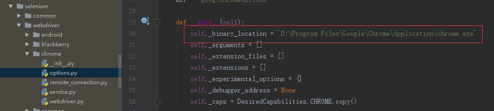

# Selenium	

selenium 是一个用于Web应用程序测试的工具。Selenium测试直接运行在浏览器中，就像真正的用户在操作一样。支持的浏览器包括IE（7, 8, 9, 10, 11），Mozilla Firefox，Safari，Google Chrome，Opera等。这个工具的主要功能包括：测试与浏览器的兼容性——测试你的应用程序看是否能够很好得工作在不同浏览器和操作系统之上。测试系统功能——创建回归测试检验软件功能和用户需求。支持自动录制动作和自动生成 .Net、Java、Perl等不同语言的测试脚本。 

**selenium用于爬虫，主要是用来解决javascript渲染的问题** 

1. Selenium 可以根据我们的指令，让浏览器自动加载页面，获取需要的数据，甚至页面截屏，或者判断网站上

   某些动作是否发生。

2. Selenium 自己不带浏览器，不支持浏览器的功能，它需要与第三方浏览器结合在一起才能使用。但是我们有

   时候需要让它内嵌在代码中运行，所以我们可以用一个叫 PhantomJS 的工具代替真实的浏览器。

#### 安装

~~~python
pip install selenium
~~~

[官方文档](https://selenium-python.readthedocs.io/index.html)


#### headless brower

无头模式是运行浏览器的一种非常有用的方式。就像听起来一样，浏览器正常运行，减去任何可见的UI组件。虽

然对网上冲浪不是那么有用，但它通过自动化测试自成一体。

简单来说是一种没有界面的浏览器。既然是浏览器那么浏览器该有的东西它都应该有，只是看不到界面而已。我们

日常使用浏览器的步骤为：启动浏览器、打开一个网页、进行交互。而无头浏览器指的是我们使用脚本来执行以上

过程的浏览器，能模拟真实的浏览器使用场景。

chrome无头浏览器：

https://developers.google.com/web/updates/2017/04/headless-chrome](https://developers.google.com/web/updates/2017/04/headless-chrome)


#### 无头Chrome入门

无头Chrome 在Chrome 59中发布。这是在无头环境中运行Chrome浏览器的一种方式。

基本上，运行Chrome没有铬！它将Chromium和Blink渲染引擎提供的所有现代Web平台功能引入命令行。

为什么这有用？

无头浏览器是自动测试和服务器环境的绝佳工具，您不需要可见的UI shell。例如，您可能希望针对真实网页运行

某些测试，创建PDF，或者仅检查浏览器如何呈现URL。


#### 安装webdriver（chromedriver）

下载地址：http://chromedriver.storage.googleapis.com/index.html

需要注意的是这个驱动需要和本地的chrome浏览器的版本号对应

**目前,最新chrome版本号69对应chromedriver版本为2.42**


##### 注意点:

1. chromedriver解压后放到Python或者其他配置了环境变量的目录下。我们这里也可以放在隔离环境venv的bin目录下.

2. 有的时候你的本机是64位,本该安装的是64位的chromedriver,但是有的时候不行,需要切换为32位的chromedriver,实际操作中,注意一下.

3. 如果执行browser = webdriver.Chrome()报错,则需要如下配置:

   

 

##### 测试代码:

~~~python
from selenium import webdriver
browser=webdriver.Chrome()
browser.get("https://www.baidu.com")
print(browser.page_source)
~~~


##### 语法参考

1. https://blog.csdn.net/qq_29186489/article/details/78661008

2. https://www.cnblogs.com/hanxiaobei/p/6108677.html


##### 定位操作

以下是所有定位操作的 API :

**返回一个匹配元素, 即一个 WebElement 元素:**
find_element_by_id()
find_element_by_name()
find_element_by_class_name()
find_element_by_tag_name()
find_element_by_link_text()
find_element_by_partial_link_text()
find_element_by_xpath()
find_element_by_css_selector()

**返回一个列表, 包含所有匹配的元素， 即一个 WebElement 列表:**
find_elements_by_id()
find_elements_by_name()
find_elements_by_class_name()
find_elements_by_tag_name()
find_elements_by_link_text()
find_elements_by_partial_link_text()
find_elements_by_xpath()
find_elements_by_css_selector()

#### 案例操作1

模拟在百度首页的输入框中搜索python,并且执行"百度一下"的按钮的enter键盘操作.

~~~python
from selenium import webdriver

from selenium.webdriver.common.keys import Keys
from selenium.webdriver.support.wait import WebDriverWait

import time

browser = webdriver.Chrome()
browser.get("https://www.baidu.com")

# 模拟搜索
input = browser.find_element_by_id('kw')
input.send_keys('python')
input.send_keys(Keys.ENTER)

print(browser.page_source)#拿到的渲染之后的页面 # 模仿人来做


# 需要等待一会 - 才能够拿到数据
wait = WebDriverWait(browser,10)
#wait.until(EC.presence_of_element_located((By.ID, "content_left")))

time.sleep(3)

with open('baidu.html','w+',encoding='utf-8') as fp:
    fp.write(browser.page_source)
    fp.close()
~~~

上述的案例,会打开chrome浏览器进入到无头模式,如果不希望打开浏览器,只希望进行模拟网页的操作,可以进行如下设置:

~~~python
from selenium import webdriver
from selenium.webdriver.common.by import By
from selenium.webdriver.common.keys import Keys
from selenium.webdriver.support.wait import WebDriverWait
from selenium.webdriver.support import expected_conditions as EC

from selenium.webdriver.chrome.options import Options
import time

chrome_options = Options()
chrome_options.add_argument('--headless')
chrome_options.add_argument('--disable-gpu')

browser = webdriver.Chrome(options=chrome_options)
browser.get("https://www.baidu.com")

# 模拟搜索
input = browser.find_element_by_id('kw')
input.send_keys('python')
input.send_keys(Keys.ENTER)

print(browser.page_source)#拿到的渲染之后的页面 # 模仿人来做


# 需要等待一会 - 才能够拿到数据
wait = WebDriverWait(browser,10)
#wait.until(EC.presence_of_element_located((By.ID, "content_left")))

time.sleep(3)

with open('baidu.html','w+',encoding='utf-8') as fp:
    fp.write(browser.page_source)
    fp.close()
~~~

#### 案例操作2

在51job中搜索java岗位

~~~python
from selenium import webdriver
from selenium.webdriver.common.by import By
from selenium.webdriver.common.keys import Keys
from selenium.webdriver.support.wait import WebDriverWait
from selenium.webdriver.support import expected_conditions as EC
from selenium.webdriver.chrome.options import Options
import time

chrome_options = Options()
#chrome_options.add_argument('--headless')
#chrome_options.add_argument('--disable-gpu')

browser = webdriver.Chrome(options=chrome_options)
browser.get("https://www.51job.com/")

# 模拟搜索
input = browser.find_element_by_id('kwdselectid')
input.send_keys('java')
#input.send_keys(Keys.ENTER)

# 点击事件
button = browser.find_element_by_class_name('top_wrap').find_element_by_tag_name('button')
button.click()

print(browser.page_source)#拿到的渲染之后的页面 # 模仿人来做


# 需要等待一会 - 才能够拿到数据
#wait = WebDriverWait(browser,10)
#wait.until(EC.presence_of_element_located((By.ID, "content_left")))
browser.implicitly_wait(3)
#time.sleep(3)

with open('51job.html','w+',encoding='utf-8') as fp:
    fp.write(browser.page_source)
    fp.close()
~~~


#### 案例操作3

获取每个链接点击之后的页面的信息

~~~python
from selenium import webdriver
from selenium.webdriver.common.by import By
from selenium.webdriver.common.keys import Keys
from selenium.webdriver.support.wait import WebDriverWait
from selenium.webdriver.support import expected_conditions as EC
from selenium.webdriver.chrome.options import Options
import time

chrome_options = Options()
#chrome_options.add_argument('--headless')
#chrome_options.add_argument('--disable-gpu')

browser = webdriver.Chrome(options=chrome_options)
browser.get("https://www.51job.com/")

# 模拟搜索
input = browser.find_element_by_id('kwdselectid')
input.send_keys('java')
#input.send_keys(Keys.ENTER)

# 点击事件
button = browser.find_element_by_class_name('top_wrap').find_element_by_tag_name('button')
button.click()

print("句柄:",browser.window_handles)

#print(browser.page_source)#拿到的渲染之后的页面 # 模仿人来做
# 打印出搜索结果页的ip地址
# print(browser.current_url)

# 再次请求搜索结果页
search_url = browser.current_url
browser.get(search_url)

#遍历出页面中48个带有超链接的图片，可以进入查看详情页

#browser.implicitly_wait(3)

#time.sleep(5)

a_links = browser.find_elements_by_xpath('//p[@class="t1 "]/span/a')
#a_links = browser.find_elements_by_class_name('t1').find_element_by_tag_name('span')
# a_links = browser.find_element_by_class_name('t1')
print(len(a_links))

for i in range(len(a_links)):
    a_links = browser.find_elements_by_xpath('//p[@class="t1 "]/span/a')
    a_links[i].click()
    browser.implicitly_wait(1)
    #time.sleep(5)
    with open('java_{0}.html'.format(i), 'w+',encoding='utf-8') as fp:
        #browser.get(browser.current_url)
        #print(a_links[i].get_attribute('href'))

        # 获取每个链接的url
        a_url = a_links[i].get_attribute('href')
        browser.get(a_url)

        #print(browser.current_url)
        data=browser.page_source
        print(browser.current_url)
        #print(data)
        fp.write(data)
        fp.close()
    browser.get(search_url)


~~~


#### 练习 - 模拟豆瓣登录

```python
from selenium import webdriver
from selenium.webdriver.common.by import By
from selenium.webdriver.common.keys import Keys
from selenium.webdriver.support import expected_conditions as EC
from selenium.webdriver.support.wait import WebDriverWait

import time

from selenium.webdriver.chrome.options import Options

try:
    chrome_options = Options()
    chrome_options.add_argument('--headless')
    chrome_options.add_argument('--disable-gpu')
    browser = webdriver.Chrome(chrome_options=chrome_options)
    # 隐式等待
    browser.get("http://www.douban.com")

    # 输入账号密码
    browser.find_element_by_name("form_email").send_keys("849962874@qq.com")
    browser.find_element_by_name("form_password").send_keys("success123")

    # 模拟点击登录
    browser.find_element_by_xpath("//input[@class='bn-submit']").click()

    # 等待3秒
    time.sleep(3)

    # 生成登陆后快照
    browser.save_screenshot("douban.png")
finally:
    browser.close()
```


